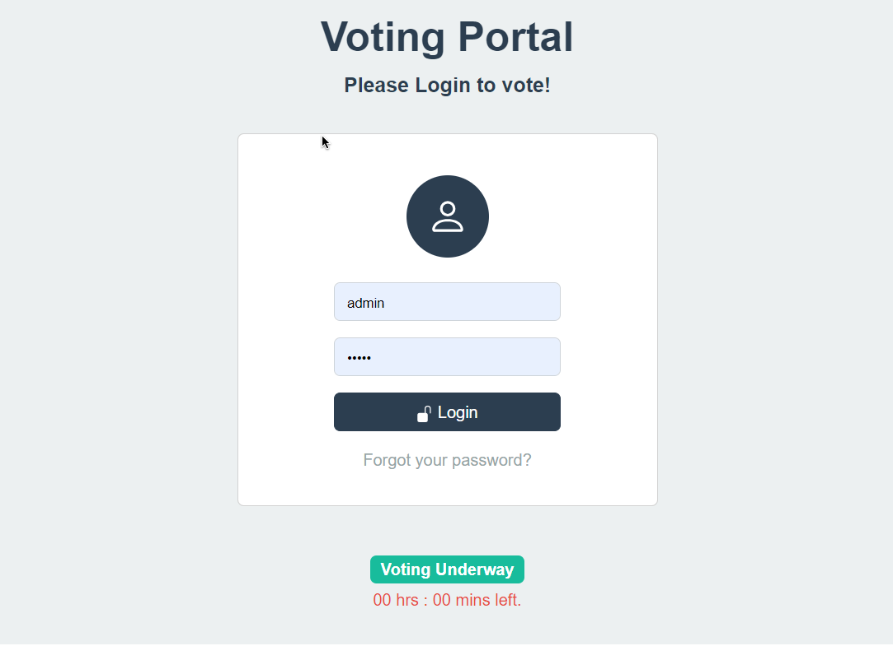
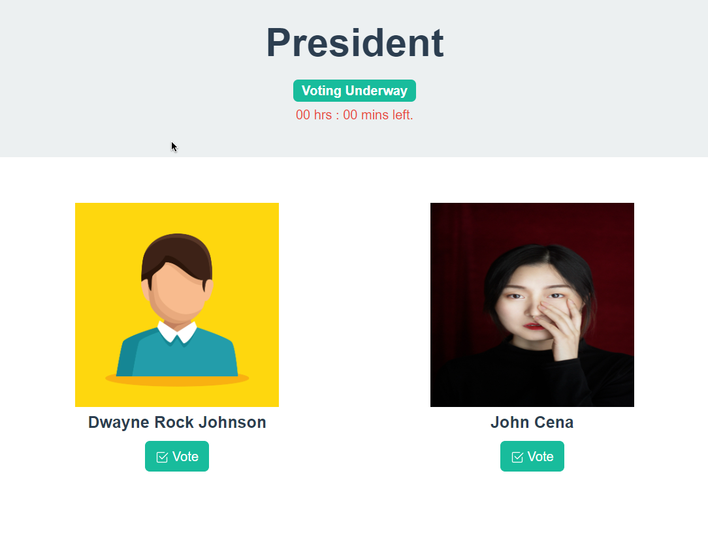
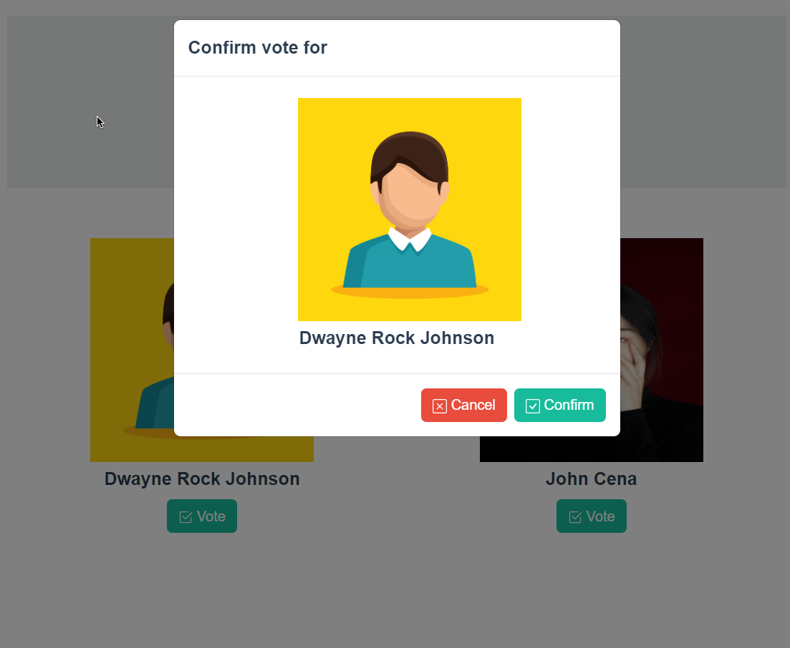

# voting_app
Simple Voting App, built with Python(django) and bootstrap 5.







## Prerequisites
* Python >= 3.10
* Django >= 4.2.2
* Pillow == 10.0.0

## Installing and using app
* Clone repository
    ```git clone <link>```
* Change directory into project folder
    ```cd voting_app```
* Create and activate vitual environment
* Install app requirements
    ```pip install -r requirements.txt```
* Run django server 
	```python manage.py runserver```
* Open ```localhost:8000``` in browser to use app

## Contributing to voting_app
To contribute to voting_app, follow these steps:

1. Fork this repository.
2. Create a branch: ```git checkout -b [branch_name]```
3. Make your changes and commit them: ```git commit -m ["commit_message"]```
4. Push to the original branch: ```git push origin [project_name]```
5. Create the pull request.
6. Alternatively see the GitHub documentation on [creating a pull request](https://help.github.com/en/github/collaborating-with-issues-and-pull-requests/creating-a-pull-request)

## Contributors
* [@ts-dave](https://github.com/ts-dave)

## Contact
You can contact me via email at [tsatsu.code@gmail.com](tsatsu.code@gmail.com).

## License
This project uses the [MIT License](https://opensource.org/licenses/MIT)
